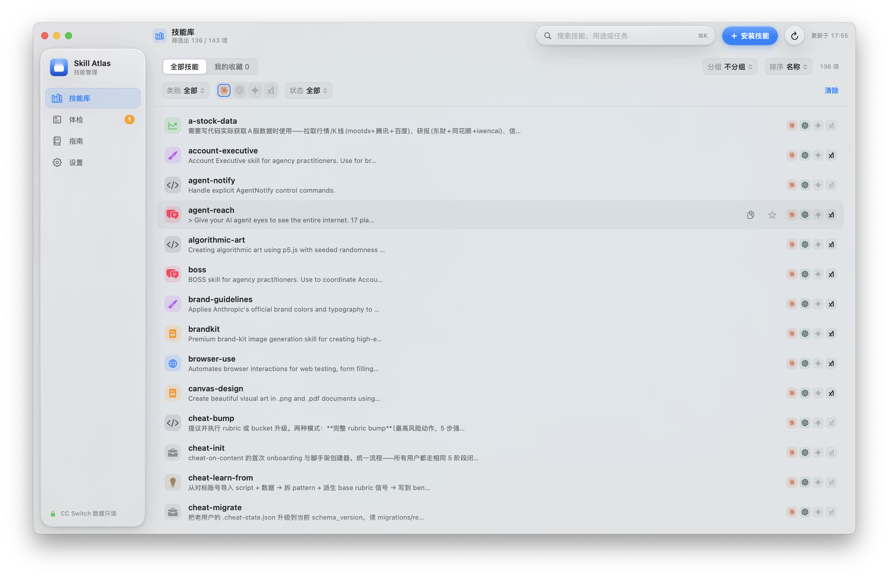
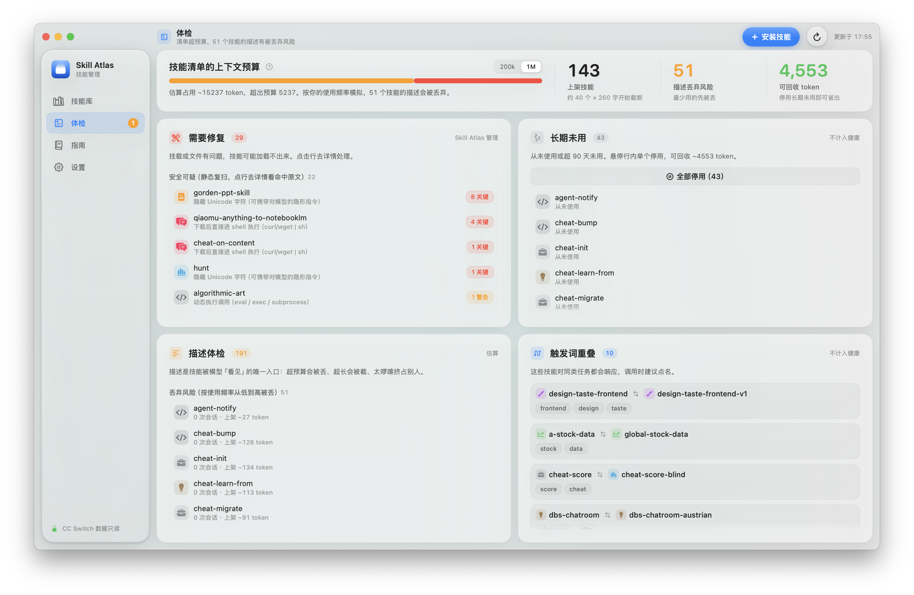
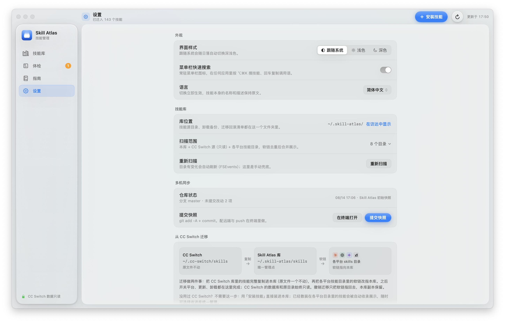

# Skill Atlas

**把散落在 Claude Code、Codex、Gemini、Grok 里的 AI 技能，收进一张本地地图。**

[](https://github.com/shoumunan/skill-atlas/releases/latest)
[](https://github.com/shoumunan/skill-atlas/releases/latest)
[](https://github.com/shoumunan/skill-atlas/releases/latest)
[](LICENSE)

[下载最新版](https://github.com/shoumunan/skill-atlas/releases/latest) · 纯原生 SwiftUI · 本地优先 · 不修改 CC Switch 原数据



## 1.3.0 有什么新东西

- **试触发**：输入一句你准备对 AI 说的话，提前看哪些技能会响应、谁排第一，以及触发词是否埋得太深。
- **安装前安全扫描**：检查动态命令、`curl | sh`、Base64 藏命令、隐藏 Unicode、全权工具声明、疑似硬编码密钥和外链；关键风险必须先看原文再决定是否安装。
- **一键发起会话**：从技能详情或菜单栏搜索直接建好 `projects/<体裁>/<日期_主题>/`，并在正确目录打开 Terminal 会话。
- **素材投递箱**：把 PDF、表格、图片或成稿拖进窗口，Skill Atlas 会按文件名和类型推荐合适的技能。
- **产出回链与生产链路**：在详情页查看最近产出、上游、下游和依赖；更新前可先看 diff，停用或卸载被依赖技能时会提醒。
- **大库治理**：支持套件/类别分组、上下文预算、描述丢弃风险、长期未用、触发词重叠、安全复扫和外链存活检查。
- **多机同步**：可把 `~/.skill-atlas/` 初始化为 Git 仓库并提交快照，换机 clone 后重新扫描即可重建挂载。
- **四语界面**：简体中文、English、日本語、한국어 即时切换；技能名称与正文保持原文。

## 不只是“列出技能”

| 管理 | 体检 | 使用 |
| --- | --- | --- |
| 扫描并去重多平台技能 | 上下文预算与描述丢弃风险 | `⌘K` 搜索，`⌥⌘K` 全局呼出 |
| 安装、更新、卸载、备份 | 挂载异常、触发词重叠、安全复扫 | 一键发起、素材投递、最近产出 |
| 平台挂载开关与分组视图 | 长期未用与可回收 token | 生产链路与调用语复制 |
| 从 CC Switch 安全迁入 | 更新 diff、依赖警告、外链复查 | 四语界面与深浅色 |

<table>
  <tr>
    <td width="50%"></td>
    <td width="50%"></td>
  </tr>
  <tr>
    <td align="center">上下文预算、安全复扫与技能治理</td>
    <td align="center">语言、外观、库位置与多机同步</td>
  </tr>
</table>

## 安装

1. 从 [Releases](https://github.com/shoumunan/skill-atlas/releases/latest) 下载 DMG。
2. 把 **Skill Atlas.app** 拖进“应用程序”。
3. 第一次打开请右键 App → **打开** → 再确认一次。

当前公开包使用 ad-hoc 签名、尚未 Apple 公证，因此直接双击可能被 Gatekeeper 拦截。系统要求：**macOS 14 Sonoma 或更新版本、Apple 芯片**。

## 管理边界

Skill Atlas 管理自己的库，CC Switch 原数据保持只读：

```text
~/.skill-atlas/
├── atlas.json          # 元数据
├── skills/             # 技能源目录，各平台软链指向这里
├── skill-backups/      # 卸载前备份，保留最近 20 个
└── migration.json      # 迁移与回滚清单
```

它会扫描 `~/.skill-atlas/skills`、`~/.cc-switch/skills`（只读）以及本机存在的 Claude Code、Codex、Gemini、Grok 等技能目录，并按真实软链落点去重。不会写入 `~/.cc-switch/cc-switch.db`，也不会修改或删除 `~/.cc-switch/skills/`。

## 常用快捷键

| 快捷键 | 作用 |
| --- | --- |
| `⌘1`–`⌘4` | 技能库 / 体检 / 指南 / 设置 |
| `⌘K` | 聚焦窗口内搜索 |
| `⌥⌘K` | 在任何应用里呼出快速搜索与“试触发” |
| `⌘N` | 安装技能 |
| `⌘R` | 重新扫描 |
| `⌘U` / `⇧⌘U` | 检查更新 / 全部更新 |
| `⌘E` | 导出 Markdown 技能清单 |

## 自动检查更新

App 启动后会定期读取仓库根目录的 `appcast.json`；发现更高版本时会提示并打开 GitHub Releases 下载页。它不会在未经用户确认时静默替换 App。

发布新版本时：

1. 同步修改 `native/Info.plist` 和 `appcast.json` 中的版本号。
2. 推送同版本标签，例如 `v1.3.0`。
3. GitHub Actions 自动构建 Apple 芯片 DMG 并创建 Release。

## 从源码构建

需要 macOS 14+ 与 Xcode Command Line Tools：

```bash
./构建原生应用.command
./打包DMG.command
```

脚本优先使用 SwiftPM；不可用时回退到仓库内的 FluidGradient 源码与 `xcrun swiftc`。产物分别为 `Skill Atlas.app` 和 `dist/Skill Atlas-<版本>.dmg`。

调试参数与产品设计约束见 [DESIGN.md](DESIGN.md)。

## 隐私与安全

技能扫描、描述分析、触发模拟、安全检查和使用记录都在本机完成。除检查 GitHub Release、安装/更新 GitHub 技能和主动执行外链存活检查外，Skill Atlas 不上传技能内容或使用数据。

安全问题请通过 GitHub 的 **Security → Report a vulnerability** 私下提交，详见 [SECURITY.md](SECURITY.md)。

## 参与贡献

欢迎提交 Issue 和 Pull Request，参见 [CONTRIBUTING.md](CONTRIBUTING.md)。项目采用 [MIT License](LICENSE)；第三方 FluidGradient 组件保留其 MIT 许可。
