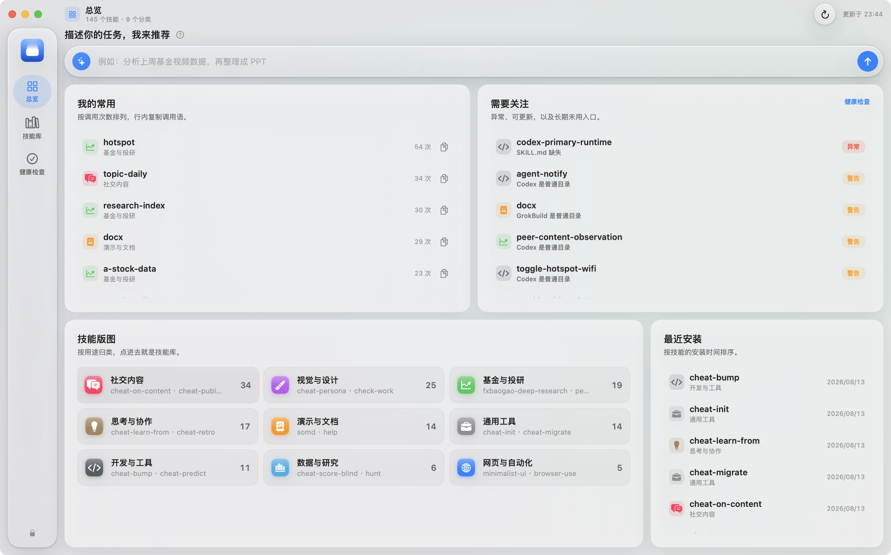

# Skill Atlas · 技能图谱

本地 AI 技能管理器：扫描散落技能、从 CC Switch 迁入、安装 / 卸载 / 更新、跨平台软链同步。替代 CC Switch 的技能管理，不是仪表盘。

[下载最新版](https://github.com/shoumunan/skill-atlas/releases/latest) · macOS 14+ · Apple 芯片 · [MIT License](LICENSE)



**管理边界：Skill Atlas 管自己的库，CC Switch 原数据不动。** 禁止写入 `~/.cc-switch/cc-switch.db` 和 `~/.cc-switch/skills/`。

**目录对标 CC Switch，全部在一个文件夹：**

```
~/.skill-atlas/
  atlas.json          # 元数据
  skills/             # 技能源目录（平台软链指向这里）
  skill-backups/      # 卸载前备份，最近 20 个
  migration.json      # 回滚清单
```

首次启动若 Application Support 里还有旧 `atlas.json`，会一次性搬进来。迁入用 `cp -c` 克隆到本库，再改软链；不删 CC Switch 原文件。

**纯原生 macOS 应用**（14+）：Swift + SwiftUI，`NavigationSplitView` + 系统侧栏 / 工具栏。进程内读 SQLite 与文件系统，不内嵌网页。

## 扫描

扫描 `~/.skill-atlas/skills`、`~/.cc-switch/skills`（只读）、以及本机存在的 `~/.claude/skills`（resolve 后可能是 `~/.mirasim/skills`）、`~/.codex/skills`、`~/.grok/skills`、`~/.<gemini|opencode|hermes>/skills`。按 `resolvingSymlinksInPath` 去重。

## 使用

从 [Releases](https://github.com/shoumunan/skill-atlas/releases/latest) 下载 DMG，把 `Skill Atlas.app` 拖进“应用程序”。首次打开请右键 App →“打开”（当前公开包为 ad-hoc 签名、尚未 Apple 公证）。启动后会扫描；若有尚未迁完的 CC Switch 技能，弹出迁移对话框（可跳过）。

- 侧栏（文字导航）：技能库 / 体检 / 指南 / 设置（⌘1–⌘4）
- 窗口内 `⌘K` 聚焦搜索（任务别名：搜「做个PPT」能命中 pptx），`⌘R` 重新扫描，`⌘N` 安装
- 任何应用里 `⌥⌘K` 呼出菜单栏快速搜索，回车复制调用语（设置页可关掉菜单栏图标）
- 平台 logo 彩色芯片（Claude Code / Codex / Gemini / Grok）：点亮/置灰，单击切换挂载
- 更新并入技能库：有新版本时列表顶部出现更新条（重新检查 / 全部更新，⌘U / ⇧⌘U），侧栏技能库行角标 = 可更新数
- 体检：挂载异常、描述体检（丢弃风险/截断/缩短建议）、触发词重叠、长期未用（行内单个停用 +「全部停用」批量治理）、上下文预算——健康信号只在这一页
- 设置：界面样式（跟随系统/浅色/深色）、菜单栏开关、库位置与扫描范围、CC Switch 迁移机制图、应用更新
- 清理 CC Switch 副本（迁移后回收磁盘）：逐目录校验「已在本库 + SKILL.md 可读 + 挂载指向本库」，未通过的保留；确认不可逆警告后移入废纸篓，`cc-switch.db` 永远不动，清理后「撤销迁移」失效
- 卸载：右键或详情页；可选只卸挂载或连库内目录进废纸篓
- `⌘E` 导出 Markdown 技能清单

## 构建

需要 macOS 14+ 与 Xcode Command Line Tools。修改 `native/swift/` 后运行 `./构建原生应用.command`。脚本先试 SwiftPM，失败则 `xcrun swiftc` 回退（本机无完整 Xcode 时走这条）。产物为 `Skill Atlas.app`。

调试参数：`-atlasPage library|doctor|guide|settings`（updates 已并入 library）、`-atlasAppearance dark|light`（优先于设置页的界面样式）、`-atlasWindow 1380x860`、`-atlasHome /path`、`-atlasSelect <技能名>`、`-atlasForceMigrate`、`-atlasCleanup`（打开清理向导）、`-atlasToggle claude`、`-atlasQuit YES`。

## 打包

运行 `./打包DMG.command` → `dist/Skill Atlas-1.2.2.dmg`。ad-hoc 签名，首次打开需右键 →「打开」绕过 Gatekeeper。macOS 14+、Apple 芯片。

## 自动更新与发布

App 启动后会定期读取本仓库最新的 GitHub Release；发现更高版本时会提示并打开 DMG 下载页。发布新版本时先同步更新 `native/Info.plist` 中的版本号，再推送同版本标签（例如 `v1.2.3`）。GitHub Actions 会自动构建 Apple 芯片 DMG 并创建 Release。

## 隐私

Skill Atlas 在本机读取和管理技能目录。除检查 GitHub Release 与安装/更新 GitHub 技能外，不上传技能内容或使用数据。CC Switch 数据库和源目录保持只读。

## 参与贡献

欢迎提交 Issue 与 Pull Request，详见 [CONTRIBUTING.md](CONTRIBUTING.md)。项目采用 [MIT License](LICENSE)。第三方 FluidGradient 组件保留其 MIT 许可。

设计规范见 [`DESIGN.md`](DESIGN.md) ⑩。
